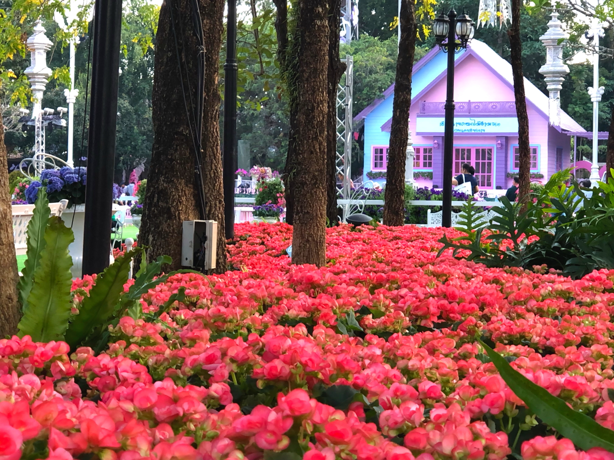
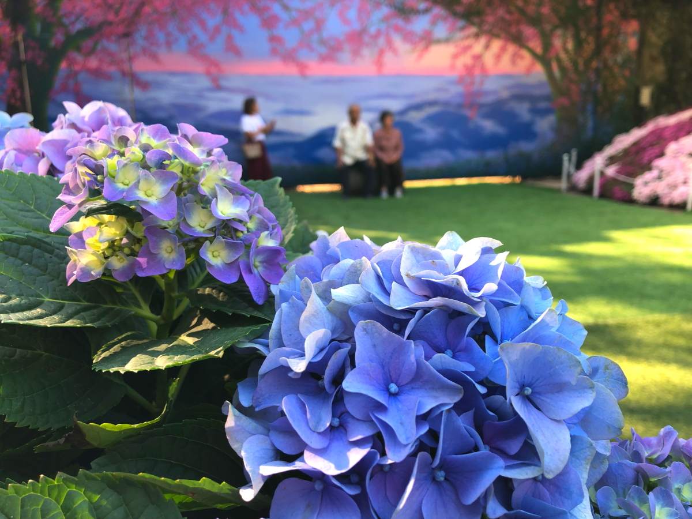
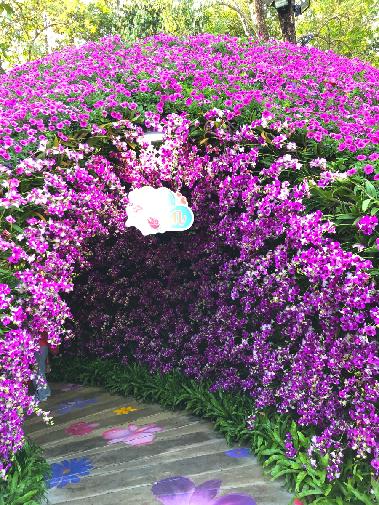
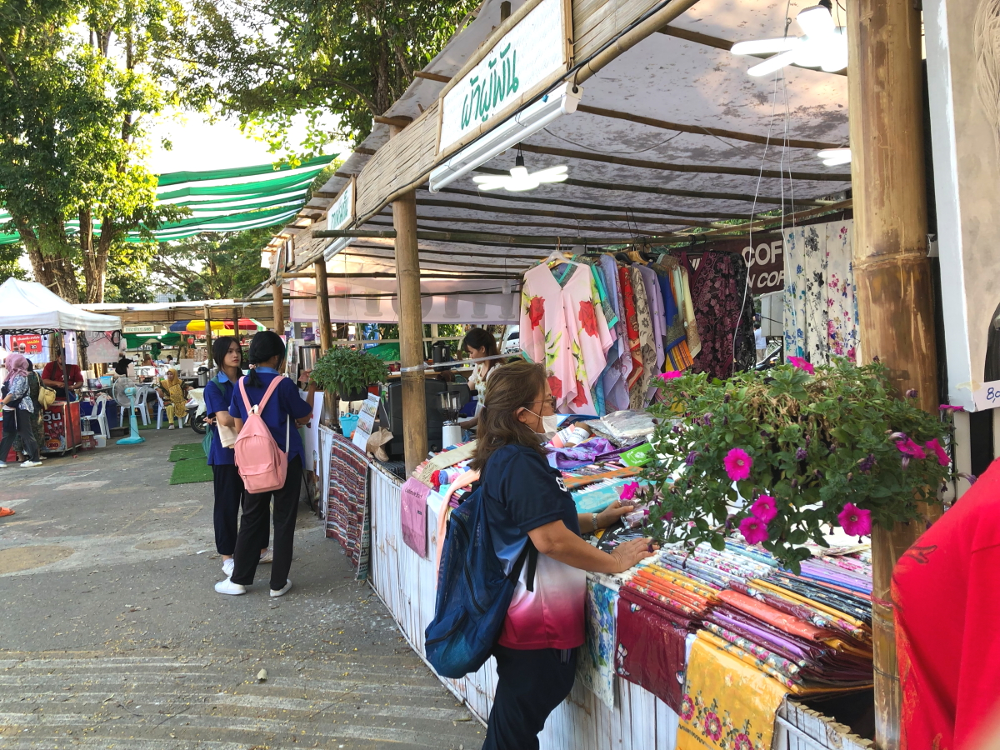

# 2024Jan_Thailand__7

<html>
<head>

<meta charset="UTF-8">
<meta http-equiv="Content-Type" content="text/html; charset=UTF-8">
<meta http-equiv="X-UA-Compatible" content="IE=EmulateIE10" />
<meta http-equiv="X-UA-Compatible" content="IE=edge">

<!--ここから上はお決まりの定型文です-->

<!--ここからが表現の書式などを決めるcssという部分-->

<link href="https://cdnjs.cloudflare.com/ajax/libs/lightbox2/2.7.1/css/lightbox.css" rel="stylesheet">

</head>

<body>

モバイル端末をお使いの場合は、画面を横向きにすると
より見やすくご覧頂けます。

<!--ここ上は、ほぼそのまま使います！-->

<!--QRコードの挿入例-->

 アクセス用QRコード

<marquee direction="left" scrollamount="20" width="30%">(^_^)/~hada</marquee>

<!--流れ文字の挿入例-->
<h1><marquee behavior="left">!!! 2024/01/08 、チェンライの植物園を訪問 !!!</marquee></h1>

<a href="https://torokoid.github.io/2024Jan_Thailand/">Thailand</a>><a href="https://torokoid.github.io/2024Jan_Thailand_2/">Thailand_2</a>><a href="https://torokoid.github.io/2024Jan_Thailand_3/">Thailand_3</a>><a href="https://torokoid.github.io/2024Jan_Thailand__4/">Thailand__4</a>><a href="https://torokoid.github.io/2024Jan_Thailand__5/">Thailand__5</a>><a href="https://torokoid.github.io/2024Jan_Thailand__6/">Thailand__6</a>>Thailand__７

                 

<!--ここから下が、本体部分-->
 
タイ観光

<h2>8日はチェンライの植物園を訪問！</h2>

<h2>南国を伺わせるお花たちが満開でした！</h2>

<h2>絵画教室 or 美術の事業が展開中</h2>

<h2>お花を観た後は、向かい側の市場に移動</h2>

<h2>外の道路には出店が出店中</h2>

<h2>マッサージ屋さんのテントもあります</h2>

<h2>ちなみに植物園の隣は仏様の施設でした！</h2>

<h2>市場の中は大賑わいでした</h2>

<h2>食べ物だけでなく、木彫りのオブジェなども多数あります</h2>

<h2>女子高生たちのスタイルが、やけに細くて目立ってました</h2>

<h2>白人さん達もたくさん来てます</h2>

<h2>少し車で移動しますが、街中の飾り付けは派手でした</h2>

<h2>中心部のデパートに行くと、そこも仏教色が強めです</h2>

<h2>象さんも神格化されてます</h2>

<h2>時計売り場ですが、シチズンとセイコーは消えてました</h2>

<h2>厚底サンダルのクロックス発見！</h2>

<h2>2511バーツは、1万円超えてますね〜</h2>

<!--
-->
<h2>ダイソーの中は、ほぼ日本</h2>

<h2>軽自動車サイズの電気自動車が展示されてます</h2>

<h2>200万円前後の値付け</h2>

<h2>晩御飯はフードコートのラーメン、50バーツ、約200円</h2>

<h2>最後は王室直営店でお買い物 税金で作った商品なので格安です</h2>

<!--
  
以下写真集！

1月2日はバンコクからパタヤまでお出かけしました。

-->

  

      

<!--本体はここまで-->

<!--画面に空白地帯を作って、背景が見えるようにしています-->
                                              

<!-- フッタ -->
<footer>

Copyright 2024/01/08 S.Hada

</footer>

<!--HPにさまざまなJavaScriptを呼び込むための書式-->

